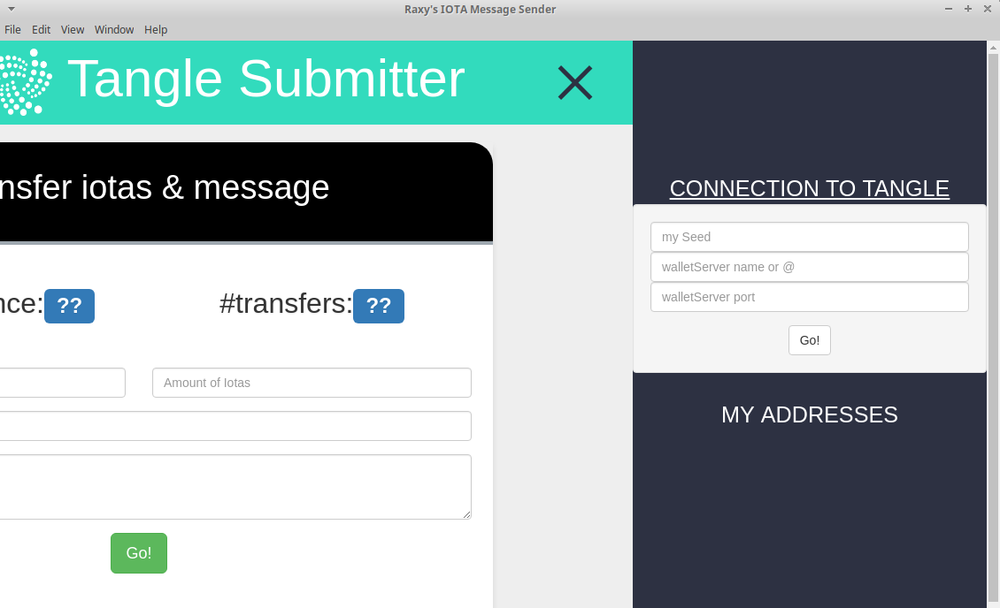
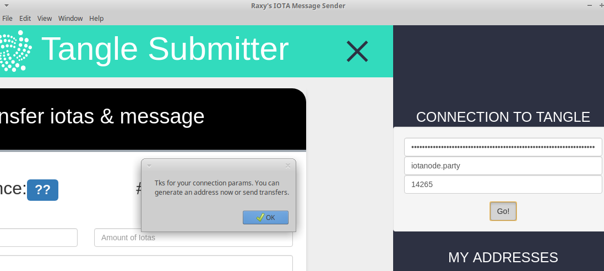
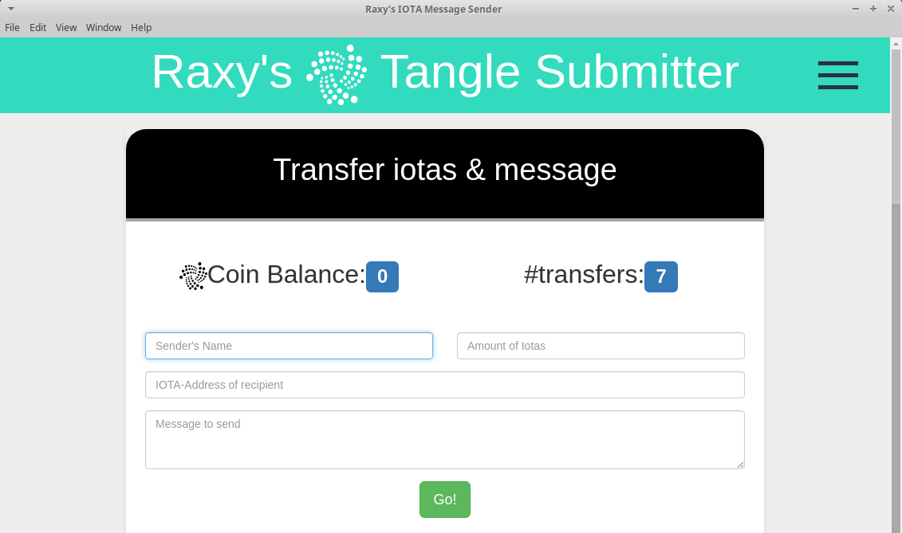

---

# IOTA Message Sender with local POW, modded by raxy

Proof of concept application using IOTA Tangle to send messages and tokens.
It's simply the IOTA Leaderboard Example https://github.com/domschiener/leaderboard-example with some modifications.
It  has to be used in pair with IOTA Message Receiver

# Differences with respect to IOTA Leaderboard Example

* Proof Of Work is perfomed locally. Usually full nodes forbid POW on their node, so light nodes connected to them can't send messages. In this application light nodes are allowed to send messages by perfoming POW on their node.
* Application runs in Electron, the same framework used by the official IOTA Wallet 
* 0 value transactions are allowed. This is useful if you just want to send a message with no money. It also avoids to change sender address for every message because 0 value transactions are not signed

# Additional mods by raxy

* show number of transfers
* can enter wallet server hostname and port
* wallet server params remain visible
* GUI cosmetics

## Prerequisites

1. Download [NodeJS](https://nodejs.org/en/download/)

2. Install [Electron](http://electron.atom.io):

  ```
  npm install -g electron
  ```

3. Install [Bower](https://bower.io/):

  ```
  npm install -g bower
  ```

#### Windows Users Only

  Run the following command as Administrator:

  ```
  npm install -g --production windows-build-tools
  ```

#### Compiling

If you wish to compile the app, install the following also: 

1. Install [Electron Builder](https://github.com/electron-userland/electron-builder)

 Electron Builder is used behind the scenes. Read their [instructions](https://github.com/electron-userland/electron-builder/wiki/Multi-Platform-Build) on how to set up your system.

2. Install [Docker](https://www.docker.com)

## Instructions

1. Clone this repository:

  ```
  git clone https://github.com/alero3/IotaMessageSender
  ```

2. Go to the `IotaMessageSender` directory:

  ```
  cd IotaMessageSender
  ```

3. Install components

  ```
  npm install
  ```

4. Run the app:

  ```
  npm start
  ```

5. If you wish to compile the app: 

  ```
  npm run compile
  ```

  If you'd like to create a package only for a specific OS, you can do so like this: 

  ```
  npm run compile:win
  npm run compile:mac
  npm run compile:lin
  ```

  Compiled binaries are found in the `out` directory.
  
  # Notes 
  
  No Default values for seed, hostname or port; you must provide them before connecting to the Tangle
  Beware of electron not being compatible with some nodejs v9.x at install time

